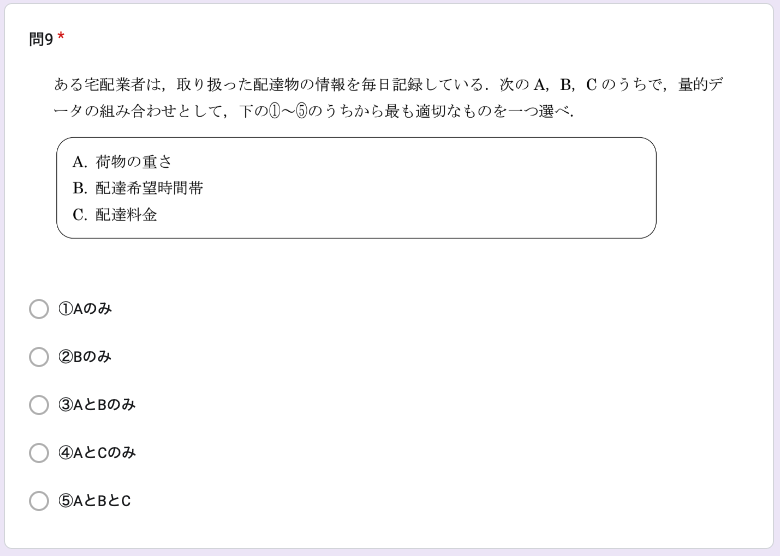
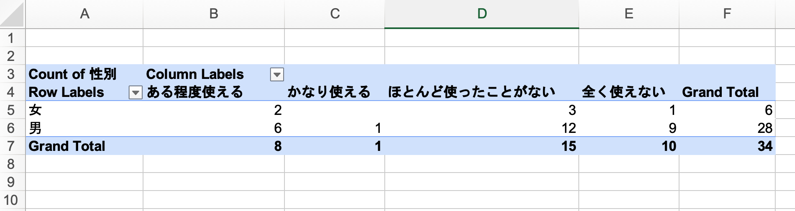
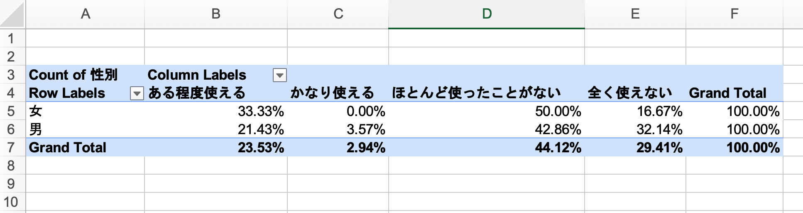
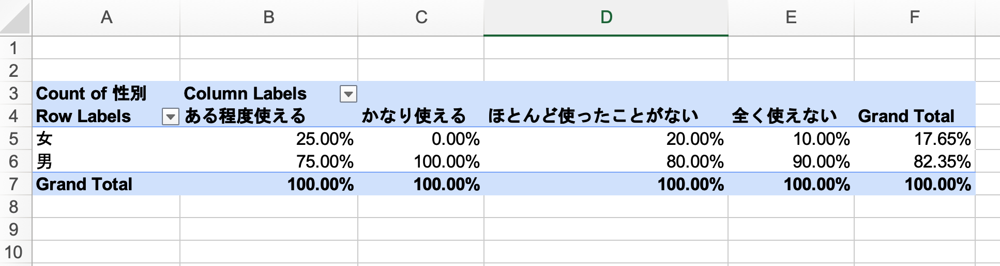

# 
<t1>
Introduction to Statistics
</t1>

#### 統計学入門

Week 3 | May 9, 2023

##

##

## Week 2 小テスト
#### 😬 😱 🫦 🙀

## 

##
ちなみに、去年は…

##

##

##

## 統計表の各部分の名称と意味

##

##

<small>

Source: [PR Times](https://prtimes.jp/main/html/rd/p/000000055.000016453.html)
</small>

##

##

## 幹葉表示 Stem and leaf plot

##

##

##

https://photos.app.goo.gl/iKbJdCmX5aADoQov9

##

##

<small>

[Source: 中央大学](https://www.math.chuo-u.ac.jp/~sakaori/R/quantitative.html)
</small>

##

<small>

https://www.populationpyramid.net/japan/2023/#google_vignette
</small>

## 
<xl>
Group activity
</xl>

質的データの集計(p３２）

##

##

##

##

##

##

## Excel playground

Googleclassroomの今日の授業資料から、「week03.xlsx」クリック

「新しいウィンドウで開く」のあと、ダウンロードする。

（Googleスプレッドシードで開くでもExcelとほぼ同じ作業が可能）

##  
ダウンロードしたファイルをダブルクリックして
Excelを開く。
（Excelを開いてから、ファイルを開くでも可）

##

<xl>
まずはボーナスタイム🥳！
</xl>

Week 2 のまとめ

Bonus points
<xl>2️⃣</xl>

## Excel操作

今日の課題：

<xl>
EXCEL操作はこのクラスで男女でどんな差がある？
</xl>

## ピボットテーブルを使おう

データを選択する

##

メニューから「挿入」、「ピボットテーブル」を選ぶ

##
<xl>
次のアウトプットを作成せよ🤓
</xl>
## Quiz #1

##

Bonus points
<xl>2️⃣</xl>

##

Bonus points
<xl>2️⃣</xl>

##

Bonus points
<xl>5️⃣</xl>
