

# Introduction to Statistics
#### 統計学入門

Week 4 | May 16, 2023

# What's up?😎
 
 
 
 
 
 
 
 
 

##
[Yosemite map](https://goo.gl/maps/8jSCxyaBmswgfQXy9)

##

グラフの種類

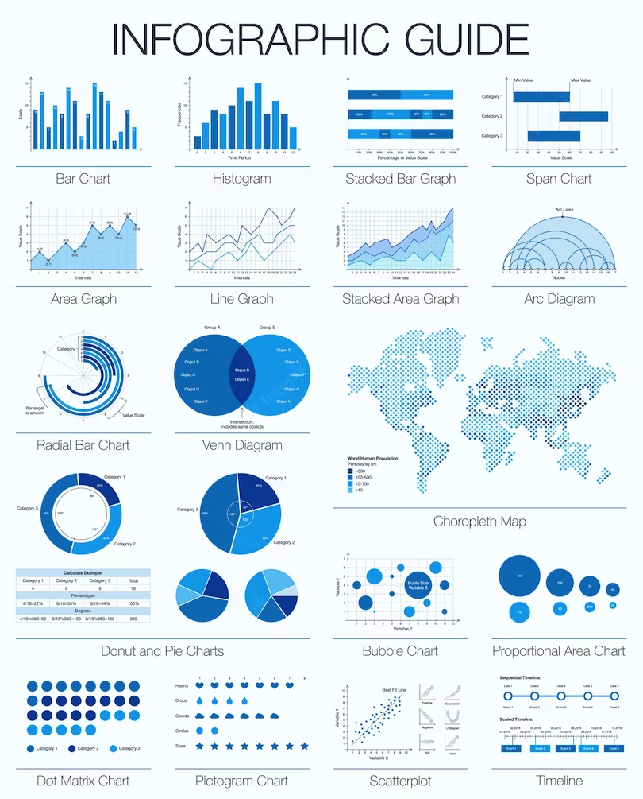

##

円グラフ
pie chart

##

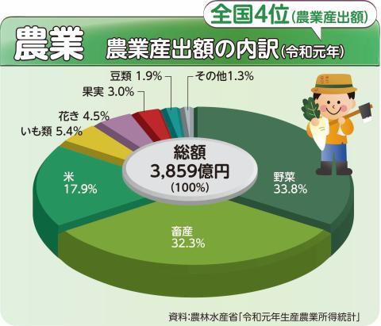

https://www.pref.chiba.lg.jp/toukei/toukeidata/graph/r4/r4nougyou.html

##

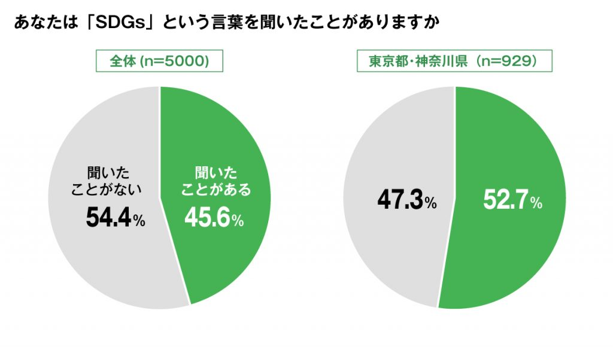

##

折線グラフ
line chart

##

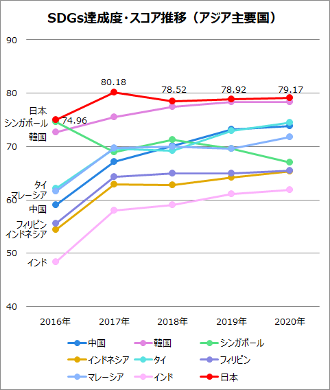

##

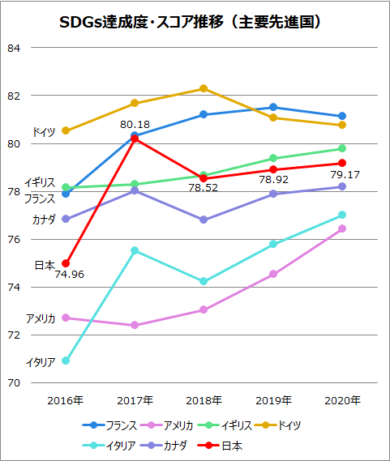

##

棒グラフ
bar chart

##
日本の食料自給率（カロリーベース）　2014年度

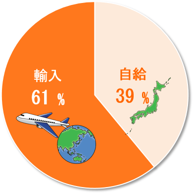
##

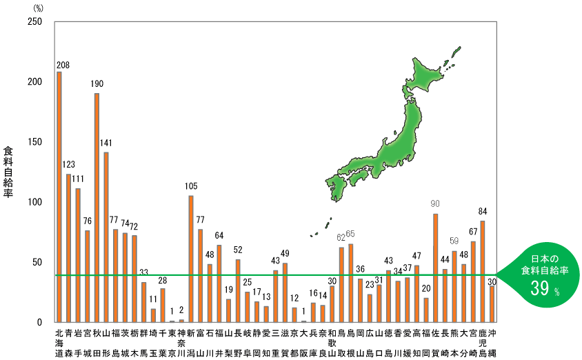

Source: https://www.cjc.or.jp/school/d/d-2-1.html

##

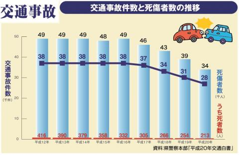

##

帯グラフ
stacked bar chart

##

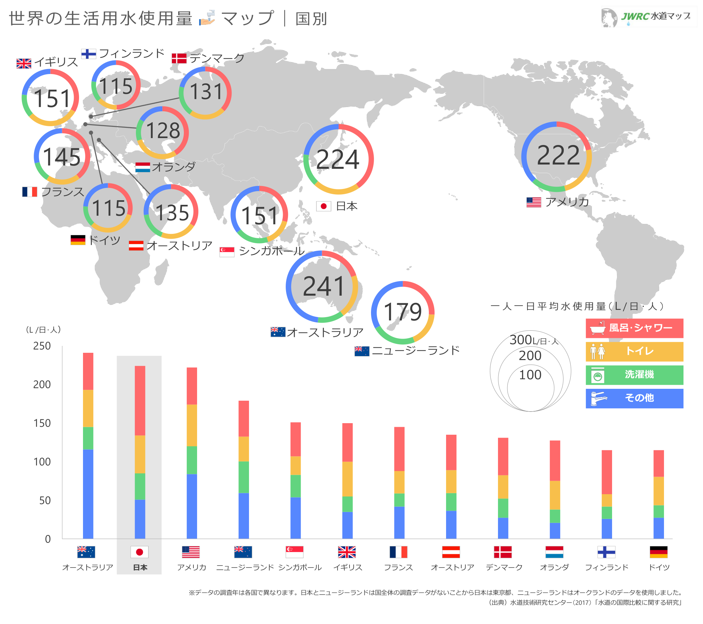

<small>

Source: http://www.jwrc-net.or.jp/map/shiyouryou_map.html

</small>

##

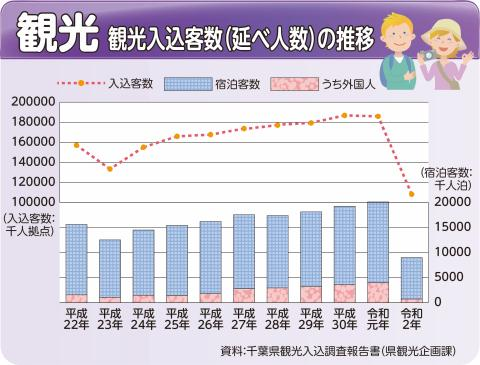

##

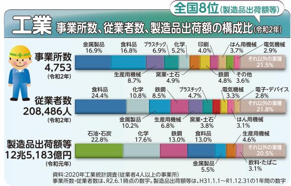

<small>

https://www.pref.chiba.lg.jp/toukei/toukeidata/graph/r4/r4kougyou.html

</small>

##

In class exercise

##

##

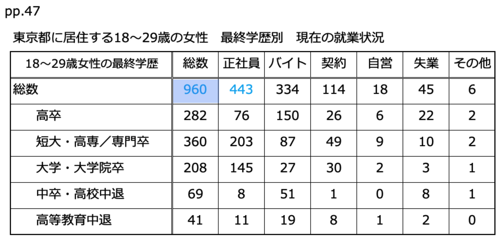

##

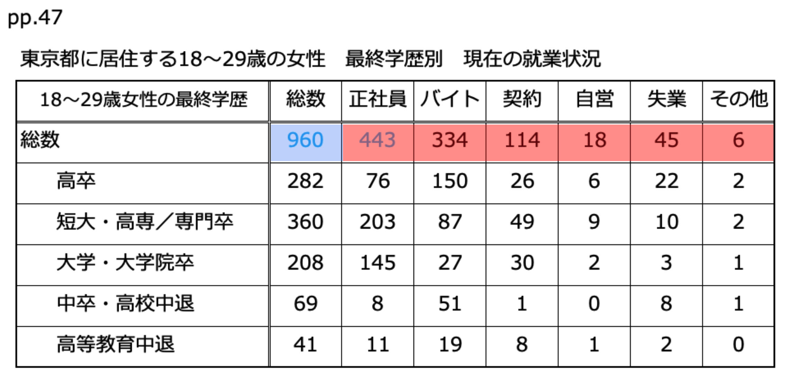

##

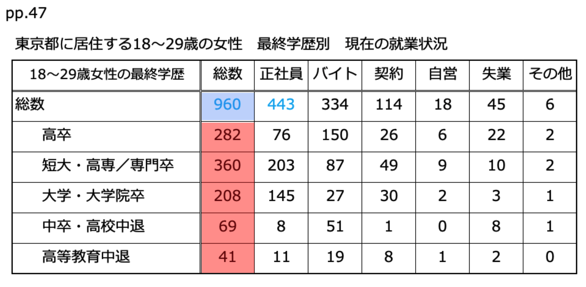

##

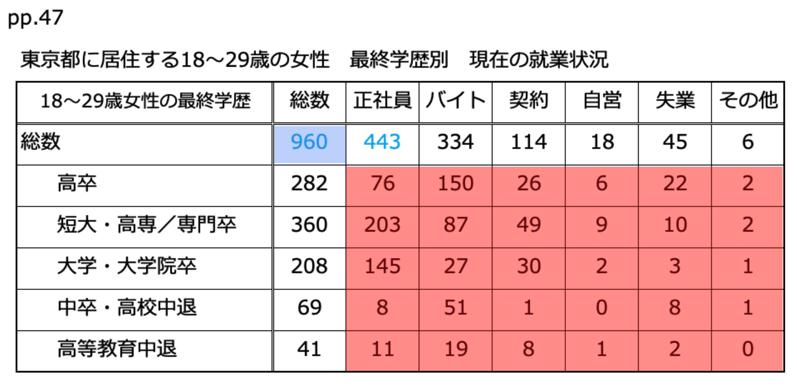

##

##

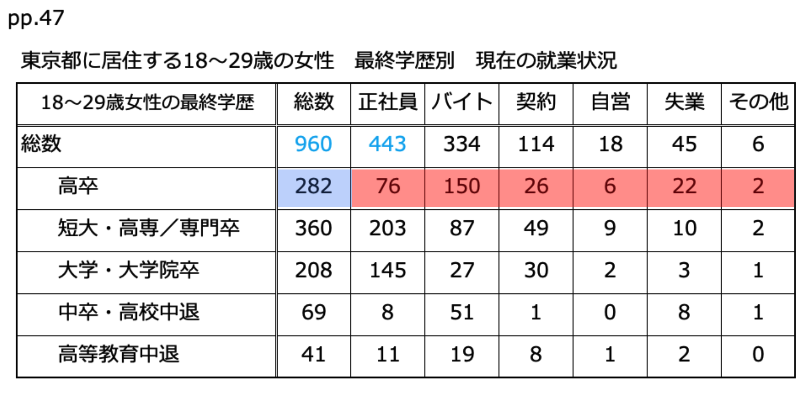

##

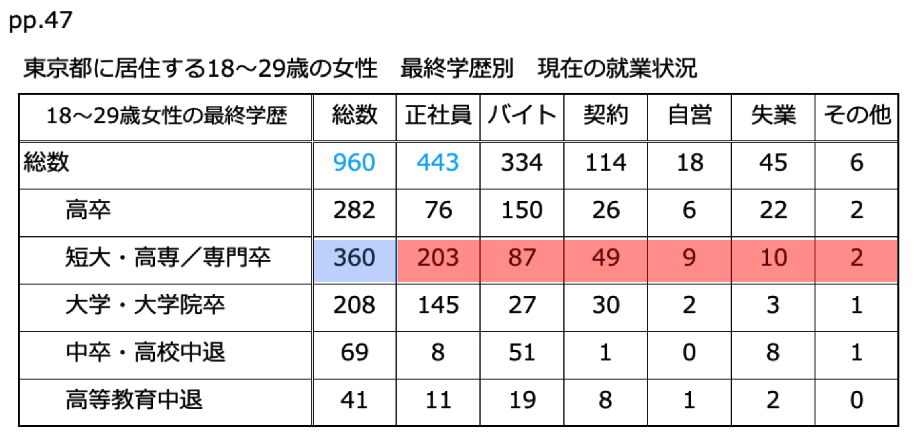

##

##

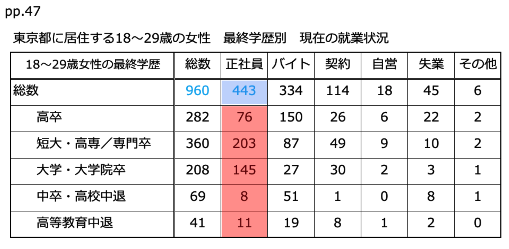

##

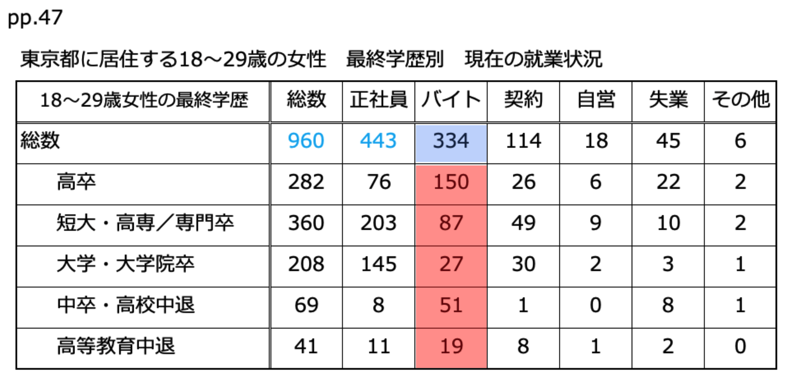

##

##

##

最終学歴で人数が一番多いのはどっちでわかる？
正社員の比率が高い順がわかるのはどっち？

##

- <plum>相対度数</plum>（そうたいどすう）とは、全体に対する比率
- <plum>累積度数</plum>（るいせきどすう）とは、一つ前の累積度数に足していく

##

##

ヒストグラム
Histograms

##

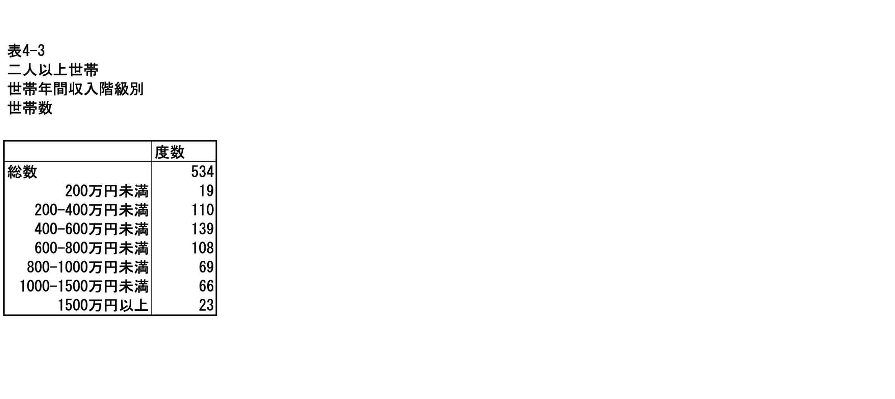

##

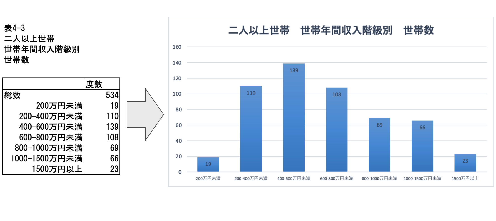

##

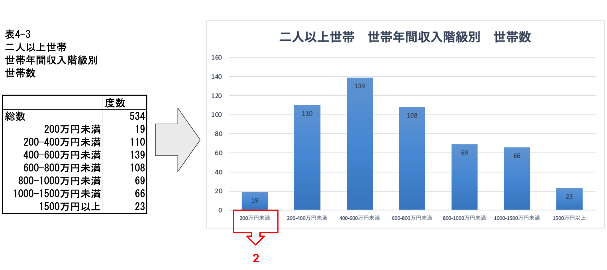

##

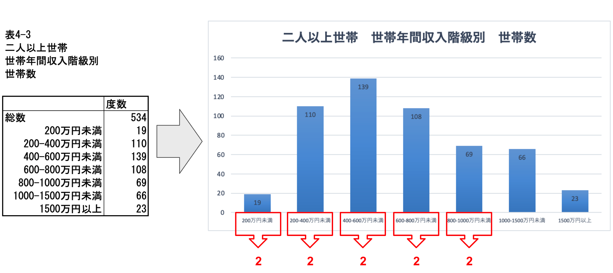

##

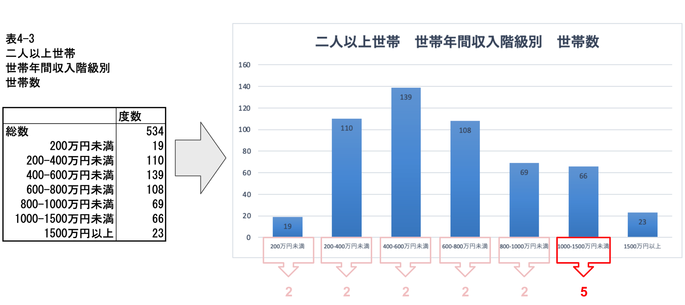

##

oh no!
<xl>😱
間隔が違う！
</xl>

##

<xl>🧐
</xl>
間隔を一定にするのがヒストグラム

Histogram to the rescue!

Let's work on page 5 together

## Excel playground

Googleclassroomの今日の授業資料から、「week4.xlsx」クリック

「新しいウィンドウで開く」のあと、ダウンロードする。

### Excelで下のグラフ両方を作る

##

<left>

でき上がったら、スクリーンショットを撮って、ボーナス課題として提出

なお、ボーナスポイントの採点は：

<plum>AとB</plum>

- <large>5️⃣points</large>：棒グラフ、凡例、タイトルがちゃんとができている
- <large>5️⃣points</large>：棒一つ一つのラベルがついている

<plum>B</plum>

- <large>5️⃣points</large>：各棒のデータのラベルがパーセンテージで表している

</left>

##  

