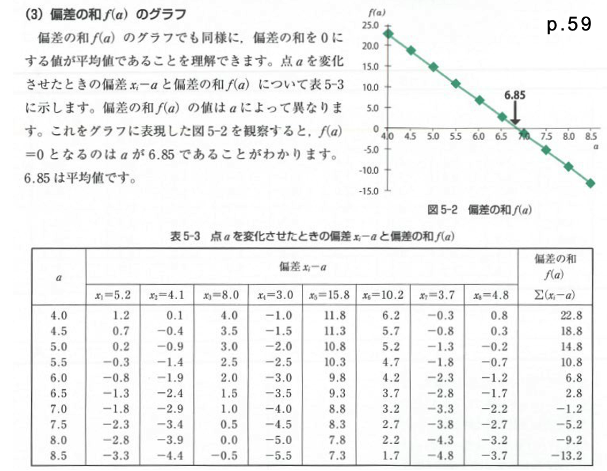
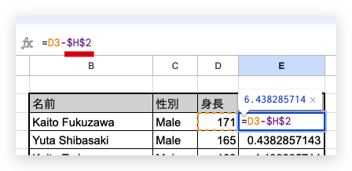

# Introduction to Statistics
#### 統計学入門

Week 5 | May 23, 2023

# What's up?😎
 
 
 
 
 
 
 
 
 

##

[bison親子](https://photos.app.goo.gl/UmhT5wgqPFya6JM38)

## Week 4 小テスト
#### 😬 😱 🫦 🙀

##

##

##

##

##

##

##

##

##

## Welcome to Sigma

Σ

##

##

##

##

<xl>

$$ \sum_{i=1}^{10} i $$

##

$$ \sum_{i=1}^{10} i = 1+2+3+4+5+6+7+8+9+10 = 55$$

##

<xl>

$$ \sum_{i=1}^{4} x_i $$

</xl>

i → |1|2|3|4
--|--|--|--|--
x → |10|15|20|30

##

<xl>

$$ \sum_{i=1}^{4} x_i = 10+15+20+30$$

</xl>

i → |1|2|3|4
--|--|--|--|--
x → |10|15|20|30

## 平均値【エックスバー】
<xl>

$$\bar{x} = \frac{1}{n} {\sum_{i=1}^{n} x_i}$$

##

<large>

$$\bar{x} = \frac{1}{4} {\sum_{i=1}^{4} x_i}=\frac{10+15+20+30}{4}=\frac{75}{4}=18.75$$
</large>

i → |1|2|3|4
--|--|--|--|--
x → |10|15|20|30

##

## Excel playground #1

Google Classroomから今週のGoogle Sheet<gray>2023 Week 5</gray>を開いて、エクセルとしてダウンロード、もしくはGoogle Sheetで作業する
（Google Sheetを選んだら多少コマンドが異なることを覚悟）

##

1. シート「１平均値と中央値」を開く
1. 平均値と中央値を関数AVERAGEとMEDIANを使わないで出す
SUMはOK

## 平均値からの偏差の総和は０

##
<xl> 

$$\sum_{i=1}^{n}(x_i-a)$$

</xl>

- $x_i$ は一人一人の身長を表す
- $a$が平均身長だとすると…

##

<xl> 

$$\sum_{i=1}^{n}(x_i-a) = 0$$

</xl>

- この式がゼロになる！
- これをクラスのデーターで検証してみましょう

## Excel playtime #2

1. シート「2 クラス身長」を開く
1. 平均身長を計算
1. 偏差：各生徒の平均身長との差を計算する列を作る
*ヒント：＄マークを使う*

1. 偏差を計算した列の合計を出して、ゼロであることを確認

## 
**今日のヒント：「$マーク」とは？**

<medium>

「＄」といえば通貨でも使用しますが、Excelでは『絶対参照』を意味します。Excelではセルを参照するときに、列方向はアルファベット、行方向は数字を使って表します。セル参照のアルファベットや数値に「$」を付けることで行や列のどちらかを固定したり、行と列の両方を固定することができます。

</medium>

<plum>PC → F4
</plum>

<plum>Mac → Command + T</plum>

## Excel playtime #3：仮の平均値

1. シート「3 アニメ身長」を開く
1. 自分で平均身長を想定して新しい列に書き込む
1. 隣にまた新しい列を作って、偏差を計算する
1. 偏差列の合計を出す（合計がゼロだったらあなたは天才！）
1. その合計から列の数を割る
1. 想定した身長に足したら平均が出ます

## Excel playtime #4
#### 2組の平均値から全体の平均値？

1. シート「4 男女平均身長」を開く
1. 全体の平均身長を計算して出す

