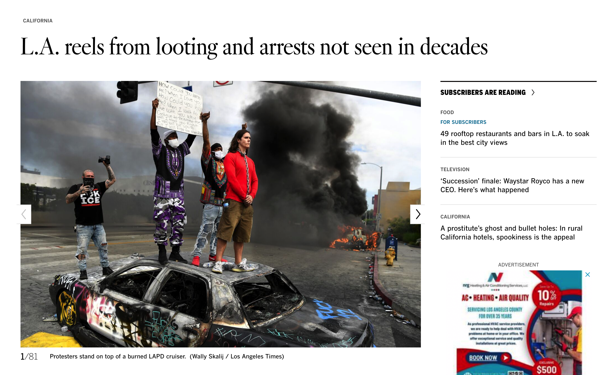

# Introduction to Statistics
#### 統計学入門

Week 6 | May 30, 2023

# One year ago...

<!--   -->
 
 
 
 
 
 
 
 

## Week 5 小テスト
#### 😬 😱 🫦 🙀

##

##

##

##

##

##

##
Three years ago...

##

##

https://photos.app.goo.gl/fRNr4QoG2QPySQ1v7

##

[Source: Crosstown](https://xtown.la/2021/02/02/burglaries-los-angeles-neighborhood/)

##

##

##

一年前とどのように変化した？

<plum>増加</plum>した？<plum>減少</plum>した？

##

##

##

##

##

##

##

変化率の推移を表している変化率の推移を表している

##

## Group activities

- 4-5人のグループ
- 何かの変化を表す統計量の記事を見つける
- 記事のスクリーンショットを撮って[このグーグルスライド](https://docs.google.com/presentation/d/18eedGPMkremMUPtx0nC50_oW2oS03J5tvbFWZUmgVNc/edit?usp=sharing)に載せる

- スライドにリンクも載せる
- <gray>変化幅</gray>と<gray>変化率</gray>を計算
- 約10分後に発表

## Excel playground

##

1. Go to: https://www.mhlw.go.jp/stf/covid-19/open-data.html
1. 死亡者数（累積）をダウンロードする
1. Excelで開く

## Observations

- What does the data look like?
- At first glance, what does it tell you?
- What statistics can you provide without doing any calculations?

## Analysis

- グループで相談しながら、色んな統計を出して発表する（10分）

## Data visualization

- 好きな都道府県を選ぶ（グループ同士で被らないように）
- 死亡日別による死亡者数の推移（累計）を表すグラフを作成する
- 先ほどのグーグルスライドに載せる
- 違う都道府県と比較するグラフを作成し、スライドに載せる

## Time difference

- 自分の都道府県の隣に新しい行を作る
- 前日との差を計算し、その日の死者数を表す
- 死亡日別による死亡者数の推移（日別）のグラフを作る
- 違う都道府県と比較するグラフを作成し、スライドに載せる

## 第7回目は、「1～6章の復習問題」です。

　※授業時間中に演習問題に回答する時間を設けます。

回答終了後、問題の解説を行います。

※第8回授業の予習範囲は、第7章：散らばりの統計量（pp.79-91）です。