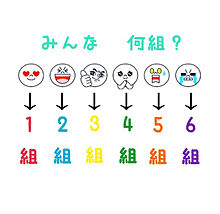
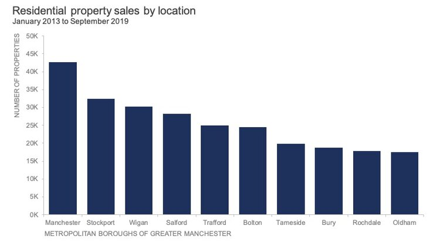
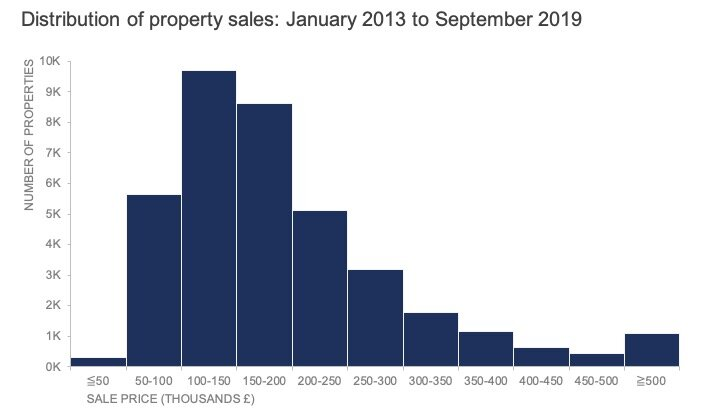
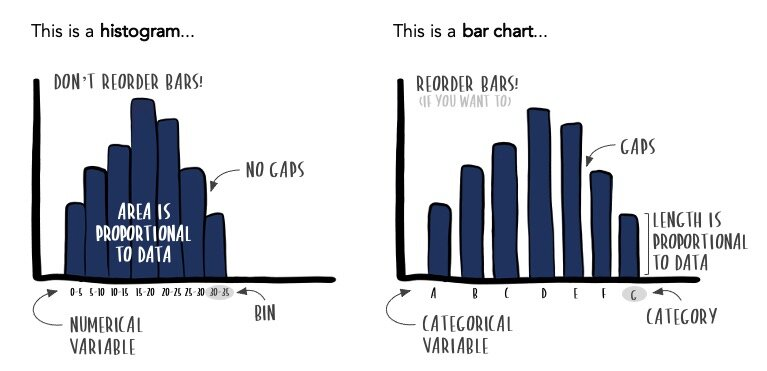
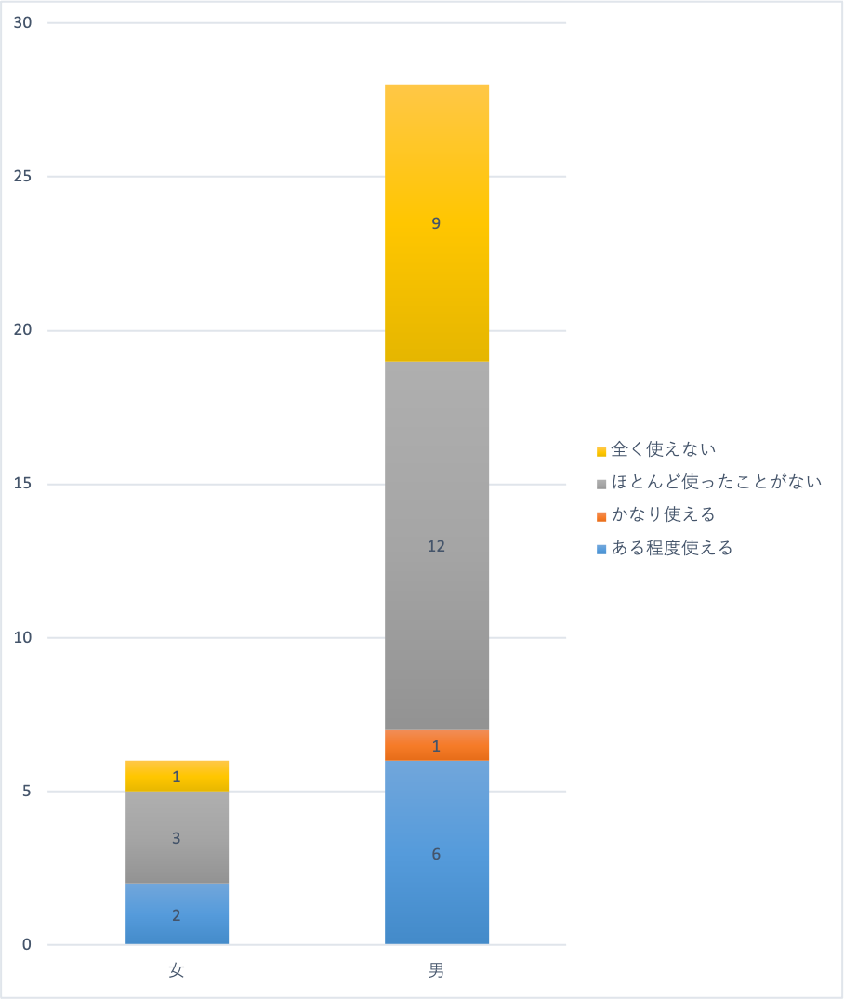
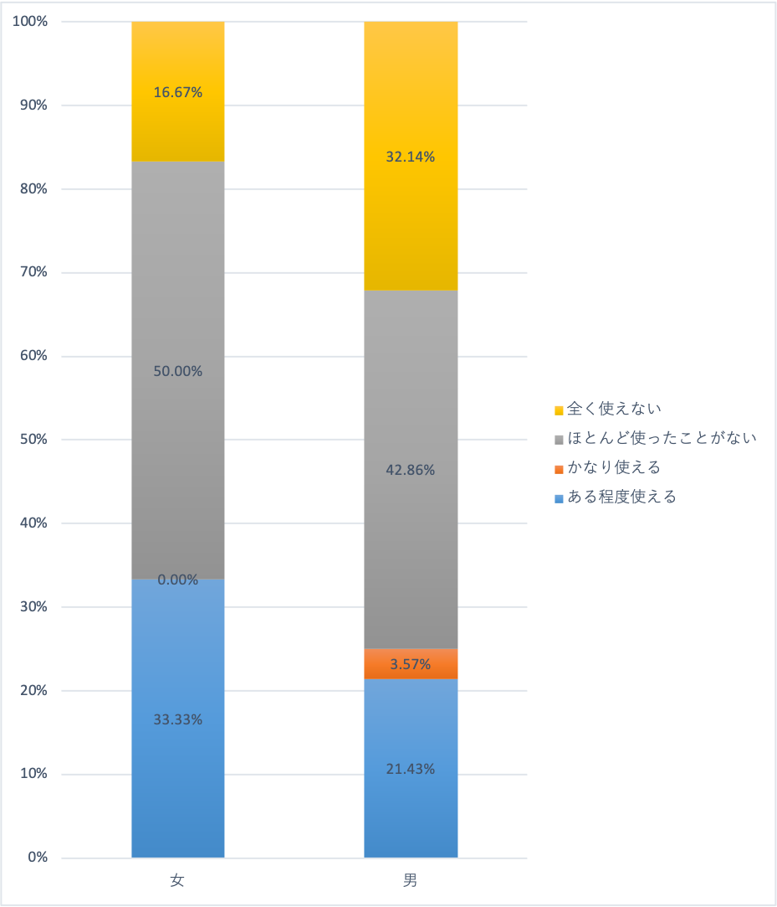
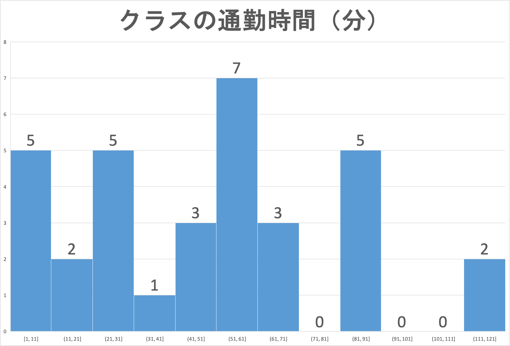
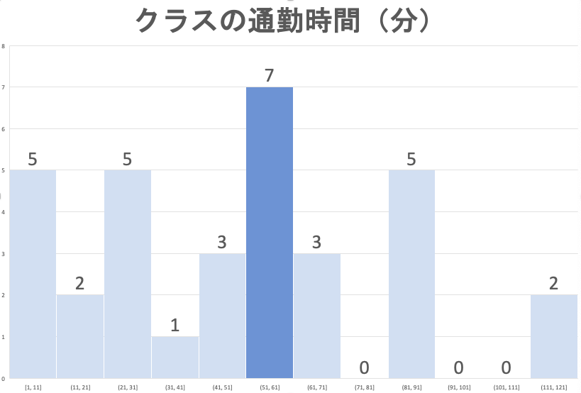

# Introduction to Statistics
#### 統計学入門

Week 7 | June 6, 2022

## Week 6 小テスト
#### 😬 😱 🫦 🙀

##

##

##

##

##

##

##

<large>
1~6章の復習

##

<plum>量的</plum>データと<plum>質的</plum>データの違い

##

背番号

<plum>量的</plum> or <plum>質的</plum><medium>🧐</medium>

##

<plum>量的</plum> or <plum>質的</plum><medium>🧐</medium>

##

<large>
グラフの区別

##

[Source: Storytelling with data](https://www.storytellingwithdata.com/blog/2021/1/28/histograms-and-bar-charts)

##

[Source: Storytelling with data](https://www.storytellingwithdata.com/blog/2021/1/28/histograms-and-bar-charts)

##

[Source: Storytelling with data](https://www.storytellingwithdata.com/blog/2021/1/28/histograms-and-bar-charts)

##

[Source: Storytelling with data](https://www.storytellingwithdata.com/blog/2021/1/28/histograms-and-bar-charts)

##

<gray>積み上げ</gray>vs<gray>棒グラフ</gray>

##

 

##

##

 

##

<large>
ヒストグラムから中央値

##

##

生徒数＝5+2+5+1+3+7+3+5+2＝<plum>33</plum>

中央値は<plum>17番目</plum>

##

