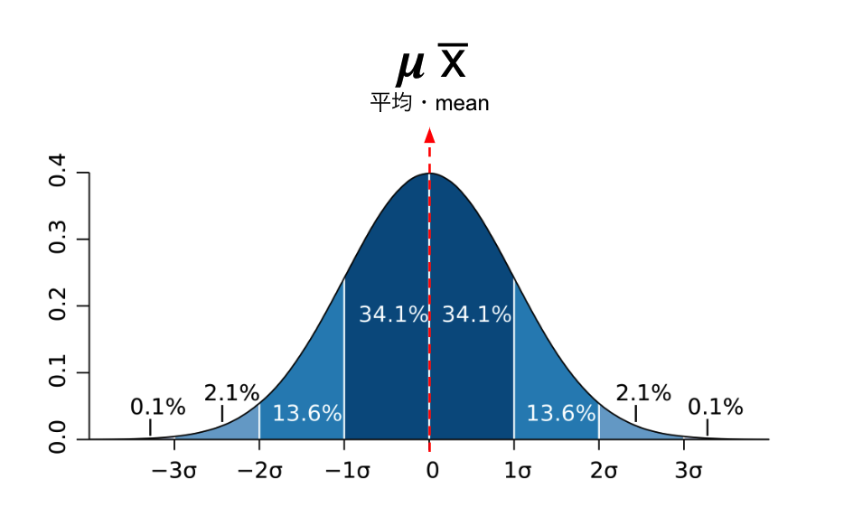
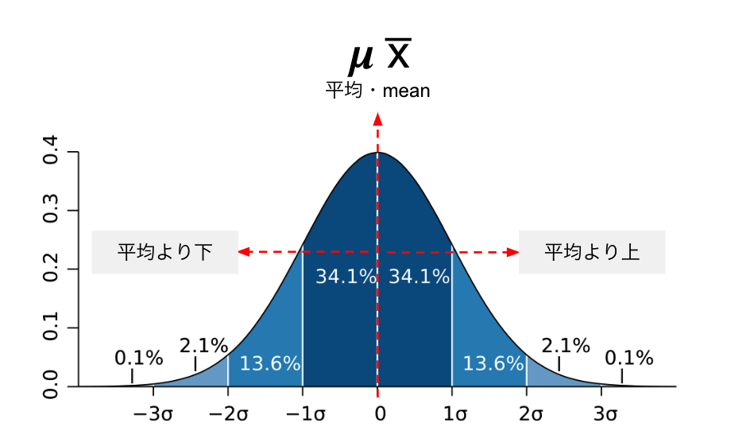
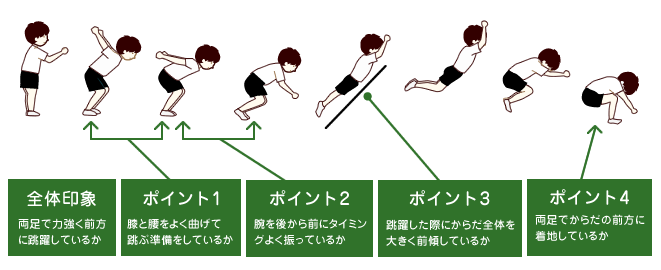

# Introduction to Statistics
#### 統計学入門

Week 8 | June 13, 2022

## Week 7 中間テスト
#### 😬 😱 🫦 🙀

##

##

##

##

##

##

##

##

##

##

##

##

##

##

##

##

##

##

##

## 
𝝈
sigma

標準偏差 standard deviation
##

<table width=100%>
<tr>
<td>
𝜮
</td>
<td>
𝝈
</td>
</tr>
<tr>
<td>足し算 sum</td>
<td>標準偏差 standard deviation</td>
</tr>
</table>

##

𝝁 

平均・mean  

##

$$\bar{x}$$

平均・mean  

平均・mean

### 標準偏差の公式
(population・母集団)

$$ \sigma =\sqrt{\frac{1}{N}\sum\limits_{i=1}^N (x_i - \mu)^2} $$

### 標準偏差の公式
(sample・標本)

$$s = \sqrt{\frac{1}{N-1} \sum_{i=1}^N (x_i - \overline{x})^2}\$$

###

$$ \sigma =\sqrt{\frac{1}{N}\sum\limits_{i=1}^N (x_i - \mu)^2} $$

$$s = \sqrt{\frac{1}{N-1} \sum_{i=1}^N (x_i - \overline{x})^2}\$$

symbol|symbol
---|:---
s・σ|標準偏差
N|データの総数（例：10000個）
Xi|各データの値（例：198cm）
x̅・ μ|データの平均（例：177cm）

##
<large>🤓</large>
標準偏差は<plum>分散</plum>の<plum>正の平方根</plum>である

##
<large>😲</large>
Say what? Then what is <plum>分散</plum>?

##

<plum>分散</plum>は…
偏差（それぞれの数値と平均値の差）を二乗し、
その平均を計算します

##
<large>😲</large>
Say what? <plum>分散</plum>はどうやって計算するの？

##

この人たちでやってみよう！

## 正規分布

The "bell" curve

##

##

### 

[体力・運動能力調査](https://www.e-stat.go.jp/stat-search/files?page=1&layout=datalist&toukei=00402102&tstat=000001088875&cycle=0&tclass1=000001133904&tclass2val=0)

<large>
立ち幅とび
</large>

で日本の統計を見て検証しましょう

### Excel/Google sheet playground

