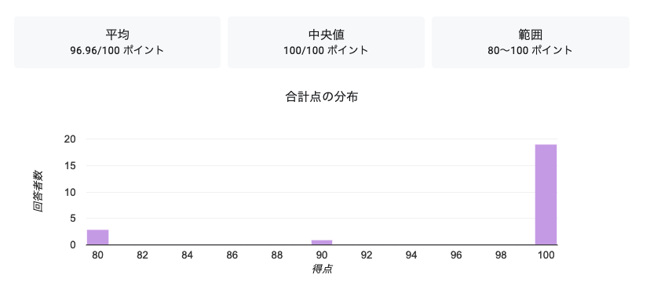

# Introduction to Statistics
#### 統計学入門

Week 9 | June 20, 2023

## Week 8 小テスト
#### 😬 😱 🫦 🙀

##

## Last week

### 標準偏差の公式
(population・母集団)

<latex>

$$ \sigma =\sqrt{\frac{1}{N}\sum\limits_{i=1}^N (x_i - \mu)^2} $$

### 正規分布

The "bell" curve

##

##

# Topic #1: 変動係数 Coefficient of Variation

データの相対的な<plum>ばらつき</plum>を表す統計量

## 

CV= σ/μ
​
変動係数 = 標準偏差/平均値
​

##

変動係数っていつ使うの？

ある測定をカテゴリー別で<plum>比べたい</plum>時！

##

例えば：男子・女子の50m走

<large>

6歳の時と19歳の時のデータの
ばらつきはどう違う？

</large>

##

##

##

## ではやってみよう！

1. グループに分かれる
1. [このページ](https://www.e-stat.go.jp/stat-search/files?page=1&layout=datalist&toukei=00402102&tstat=000001088875&cycle=0&tclass1=000001133904&tclass2val=0)から好きな項目を選ぶ
1. EXCELファイルをダウンロードして開く
1. 変動係数を計算する
1. 面白く発表！

# Topic #2: 標準化とZ得点 Z-Score

#

<latex>

$$ Z得点 = \frac{x_i - \mu}{\sigma} $$

</latex>

### 

このクラスの平均身長
165cm(μ)
標準偏差
7cm(σ)
先生の身長は177cm ➡︎ 標準化すると？

##

<latex>

$$ Z得点 = \frac{177 - 165}{7} = 1.71 $$

</latex>

###

###

###

###

### すなわち

###

https://www.mathsisfun.com/data/standard-normal-distribution-table.html

# Topic #3: 偏差値

##

偏差値は、テストや試験の結果を分かりやすく比較するための指標です。偏差値は、あなたのスコアが他の人々と比べてどれくらいの位置にあるかを示す数値です。

##

それって変動係数と一緒じゃないの？

##

You are right! But the difference is...

偏差値のスケールでは、<plum>50</plum>が平均値とされ、標準偏差が<plum>10</plum>とされています。

偏差値の計算には、次の手順を使用します。

##

偏差値の計算:

<latex>

$$ 偏差値 = Z得点 \times 10 + 50 $$

</latex>

##

先ほどの先生の身長は177cmだと、偏差値は？

<latex>

$$ 偏差値 = 1.71 \times 10 + 50 = 67.1 $$

</latex>

### 
では、あなたは？

### Excel playground

## EXCEL Hints

(カッコの中の英数字はデータによって異なる)

<gray>平均　= AVERAGE(D4:D30)
<gray>合計　= SUM(E4:E30)
<gray>偏差　= SUM(=C4/$C$31)（ドル縛り）
<gray>偏差二乗　= D4^2
<gray>分散の平方根　= SQRT(J5)
<gray>Nは？　= COUNTA(B4:B30)