

# Introduction to Statistics
#### 統計学入門

Week 10 | June 27, 2023

## Week 9 小テスト
#### 😬 😱 🫦 🙀

##

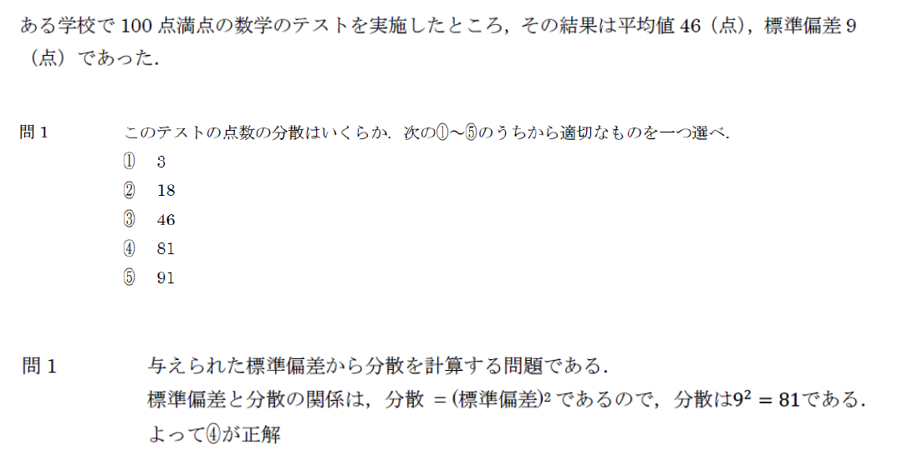

##

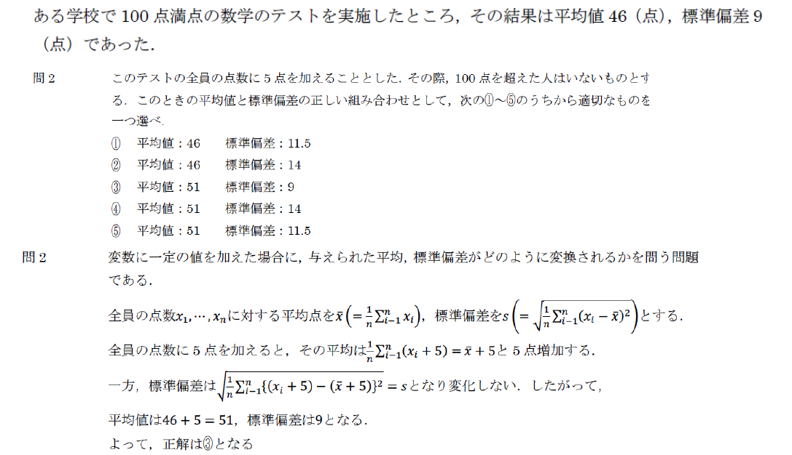

##

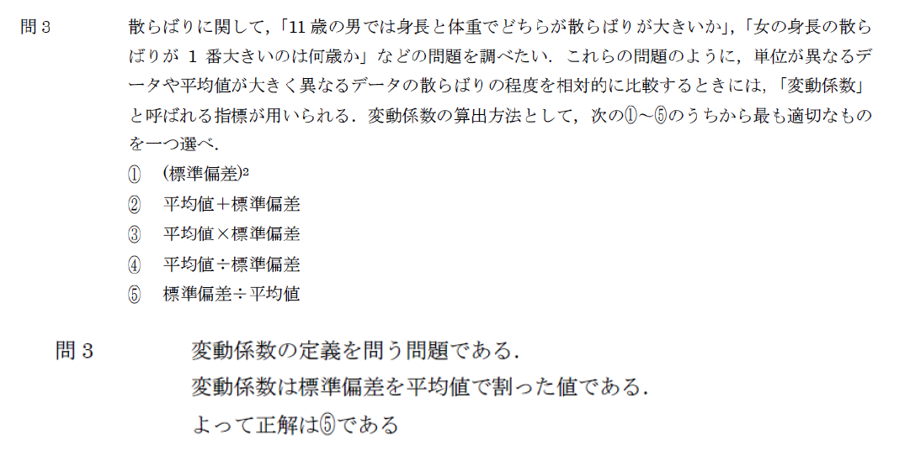

##

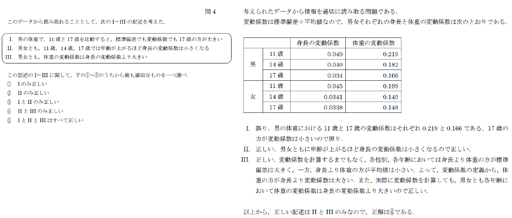

##

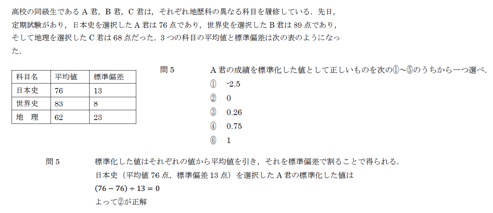

##

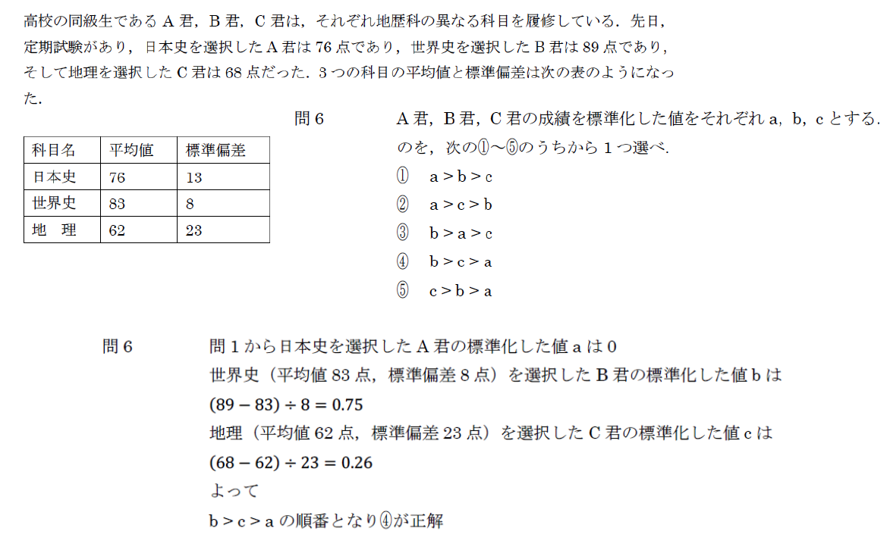

##

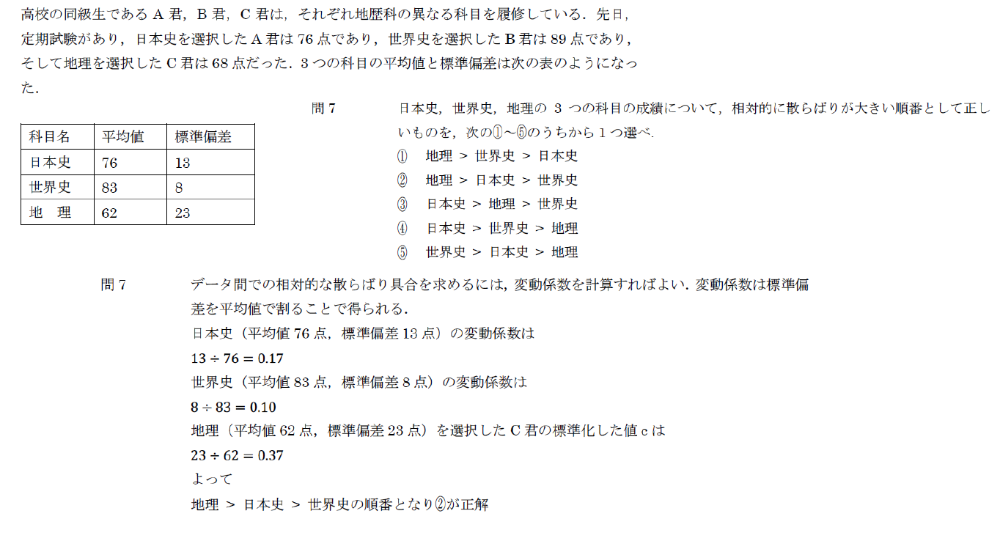

##

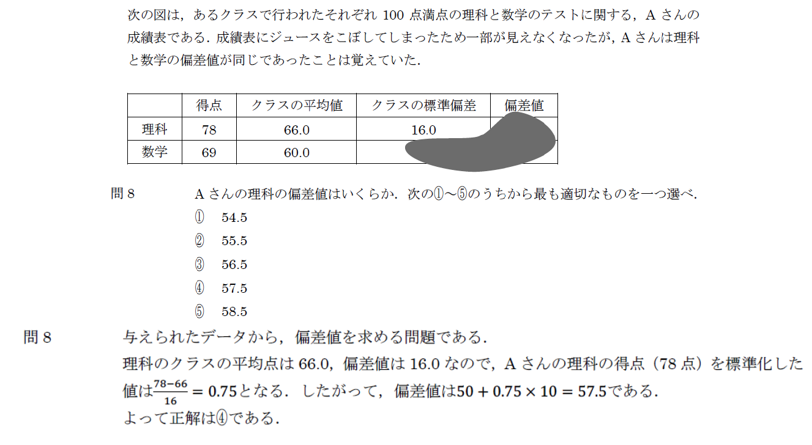

##

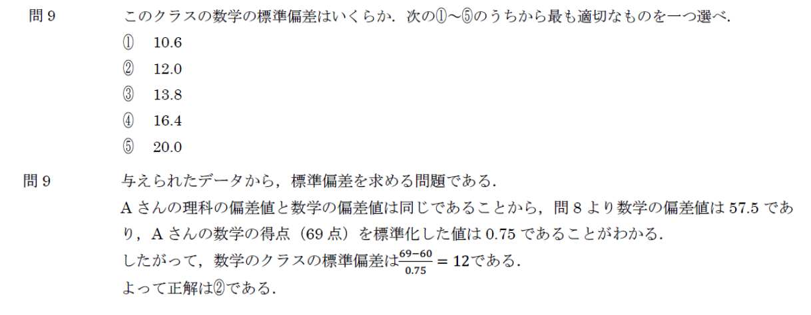

##

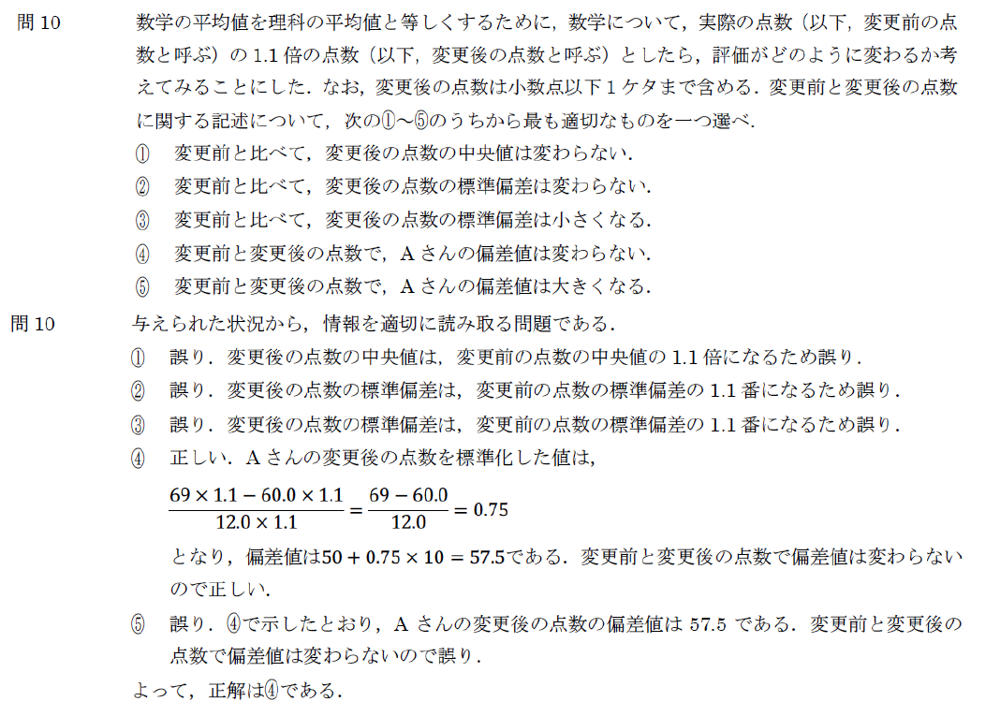

## Last week

### 正規分布

The "bell" curve

# 変動係数 Coefficient of Variation
分布の拡がりを表現する統計量
## 

CV= σ/μ
​
変動係数 = 標準偏差/平均値
​

# 標準化とZ得点 Z-Score

### 

このクラスの平均身長
165cm(μ)
標準偏差
7cm(σ)
先生の身長は177cm ➡︎ 標準化すると？

###

###

###

###

###

(177-165)/7 = 1.71

(求める身長-平均値)/標準偏差 = 標準化した変数

### すなわち

###
Today's topic:

<t1>

Box Plots
箱ヒゲ図

</t1>

##
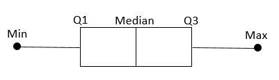

### 散らばりのグラフ表現

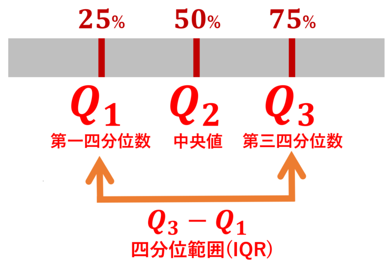

Image source: https://mathlandscape.com/box-plot/

###

Image source: https://mathlandscape.com/box-plot/

##
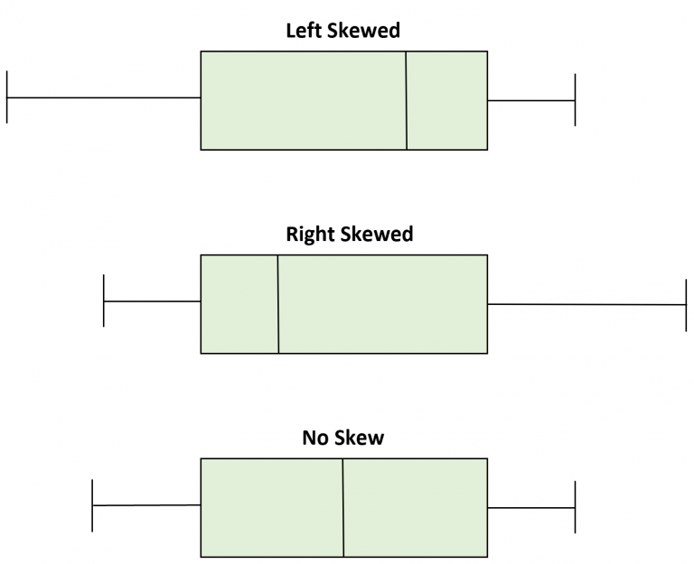
 
 
<small>

Source: [Statology](https://www.statology.org/box-plot-skewness/)
</small>

##

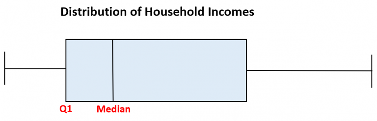

世帯収入の分布

 
 
<small>

Source: [Statology](https://www.statology.org/box-plot-skewness/)
</small>

##
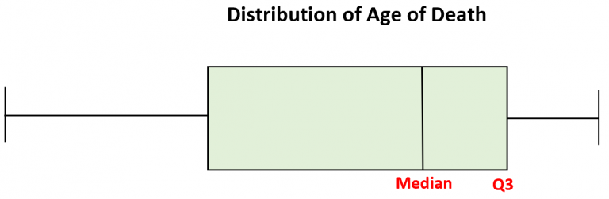

死亡年齢の分布

 
 
<small>

Source: [Statology](https://www.statology.org/box-plot-skewness/)
</small>

##
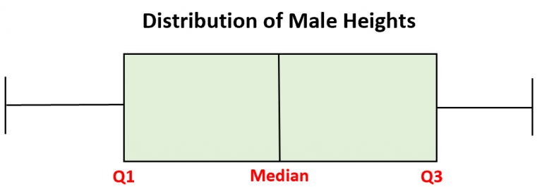

男性の身長の分布

 
 
<small>

Source: [Statology](https://www.statology.org/box-plot-skewness/)
</small>

###

<xl>
Box with whiskers (外れ値)

###

<small>Image source: https://mathlandscape.com/box-plot/</small>

###

###

Animeの身長データで
やってみよう

##

###

###

###

###

###

##

##

### Group Activity

##
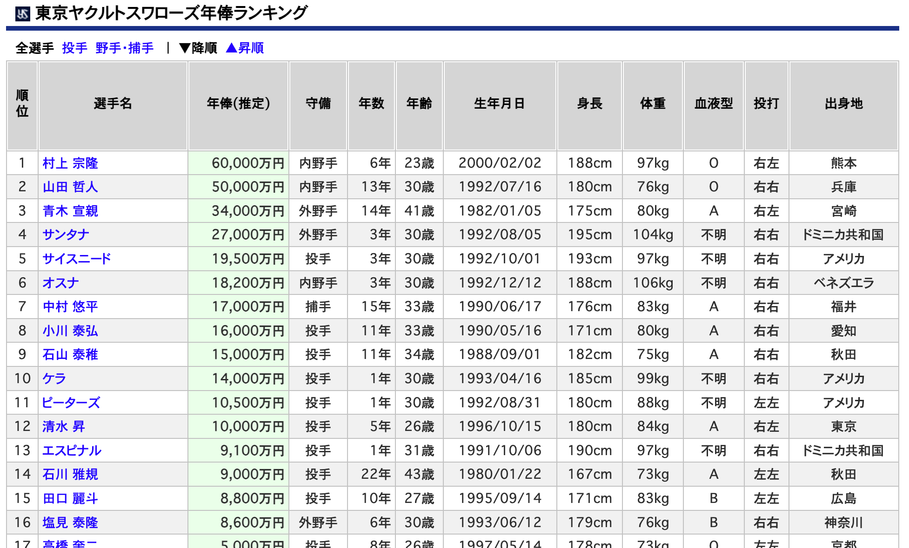
https://baseball-data.com/ranking-salary/s/

##

1. クラスで１２グループに分かれる
1. １２球団を一つずつ選ぶ
1. グループで箱ヒゲ図を作る：年棒
1. 年棒は2000万円以上の選手に限る

##

中央値はどの枠にある？
第一四分位置は？
