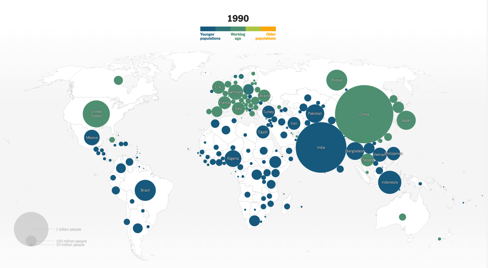

# Introduction to Statistics
#### 統計学入門

Week 13 | July 18, 2023

### 今後のスケジュール

Week|Date|Topic
:--|:--|:--
13|7/18/23 (今日)|期末テスト準備パート２
14|7/25/23|期末テスト準備パート３
15|7/26/23(水曜11時40分~12時40分)|期末テスト

##

Why I want you to speak "data"

なぜ「データ」にこだわるか

##

 
 
 
 
 
 
 
 
 
 
 
 
 

[source](https://www.nytimes.com/interactive/2023/07/16/world/world-demographics.html?unlocked_article_code=BnT1wM8hUQKa3fm7sHnIMlt-1MlIWeZyCj4S68gA8vAhorGWTSWa_gKUJLAXgcDsdFnDxaFTylr8k84FTVUxWLbavlSM7UHTGLnewDPUWE9kj0AVntPE7hqHN0d4690bnyqAYiQYqkLvCkmOVaxQFWPBK03F9T2TZn4GloSmD1xiTuUc-ytwxrVCRorUr_WyJEngIs03BPk-oyaqbJCAbUvxgn2pG_QUKMFLEvwUuJK2nKVd-AWdxx52YahU8-fFUNyokiozF48H5z1N8qVPpPk7mGQqOwx56jK3xjS336d03VO4BDwmZ2PZQRaFtzg1Bkn9lFipTEJ3RNVBA6n4EFBhJBe9AmdnH2Vo&smid=url-share)

##

今日のまとめ課題：

<medium>
<plum>平均値</plum>と<plum>分散</plum>と<plum>標準偏差</plum>と<plum>相関係数</plum>

</medium>

##

標準偏差の求め方 

順番 |　統計 |　記号 | 式
--|--|--|--
1| 平均値|$\mu$ | $\frac{1}{N}\sum x_i$
2| 偏差 | - |$x_i-\mu$
3| 偏差平方 | - |$(x_i-\mu)^2$
4| 偏差平方の和 | - |$\sum(x_i-\mu)^2$
5| 分散 | $\sigma^2$ |$\frac{1}{N}\sum(x_i-\mu)^2$
6| 標準偏差 | $\sigma$ |$\sqrt{\sigma^2}$

　
###

##

##

##

##

まずは<plum>平均値</plum>

<latex>

$$ \mu =\frac{1}{N}\sum\limits_{i=1}^N x_i $$

</latex>

##

n(データ数)　＝　25人

##

##

studyの平均 = 70/25 = 2.8

reitakuの平均 = 168/25 = 6.72

##

平均からの<plum>偏差</plum>

##

##

平均からの偏差の二乗
（偏差平方）

##

二乗なのでマイナスはありえない！

##

偏差平方の合計

##

<plum>分散</plum>

<large>
studyの分散 = 858/25 = 34.3

reitakuの分散 = 111.04/25 = 4.44

##

<plum>標準偏差</plum>

<medium>
studyの標準偏差 ＝ 34.32の平方根 ＝ 5.86
reitakuの標準偏差 ＝ 4.44の平方根 ＝ 2.11

##

<plum>共分散</plum>

二つの変数の平均からの散らばりを統計的に図る

 

$$
s_{xy} = \frac{1}{n}\sum_{i=1}^n(x_i-\overline{x})(y_i-\overline{y})
$$

##

<medium>

共分散 = 98.6 (偏差の積の合計) / 25 = 3.94

##

<plum>相関係数</plum>

 

$$ 相関係数 = \frac{共分散}{studyの標準偏差*reitakuの標準偏差}$$

 

<large>

$$ 相関係数 = \frac{3.94}{5.86*2.11} = 0.32
$$

##

<table>
<tr class=gray>
<th>相関係数rの値</th><th>相関</th>
</tr>
<tr>
<td>

$$ 
-1\hphantom{.0} \leq r \leq -0.7
$$

</td>
<td>
    強い負の相関
</td>
</tr>

<tr>
<td>

$$ 
-0.7 \leq r \leq -0.4
$$

</td>
<td>
    負の相関
</td>
</tr>

<tr>
<td>

$$ 
-0.4 \leq r \leq -0.2
$$

</td>
<td>
    弱い負の相関
</td>
</tr>

<tr>
<td>

$$ 
-0.2 \leq r \leq \hphantom{-} 0.2
$$

</td>
<td>
    ほとんど相関がない
</td>
</tr>

<tr>
<td>

$$ 
\hphantom{-}0.2 \leq r \leq \hphantom{-}0.4
$$

</td>
<td>
    弱い正の相関
</td>
</tr>

<tr>
<td>

$$ 
\hphantom{-}0.4 \leq r \leq \hphantom{-}0.7
$$

</td>
<td>
    正の相関
</td>
</tr>

<tr>
<td>

$$ 
\hphantom{-}0.7 \leq r \leq \hphantom{-}1\hphantom{.7}
$$

</td>
<td>
    強い正の相関
</td>
</tr>
</table>

##

ではやってみよう

まずは紙で、残りの９変数の相関係数を計算する

<small>
<plum>club</plum> <plum>work</plum> <plum>game</plum> 
 
 
<plum>sleep</plum> <plum>hangout</plum> <plum>teacher</plum> 
 
 
<plum>support</plum> <plum>academic</plum> <plum>facility</plum>

</small>

ボーナスポイント<large>3️⃣</large>点ずつ！

<small>一枚ずつ写メでアップロード</small>

##

答えは自分で　Google Sheet　で計算して、確認しよう

1. [このシートを自分のアカウントにコピー](https://docs.google.com/spreadsheets/d/1j9djEQW43nQ0i0pqOGLpJ-AOnIYE-Dd_ZjEf07DKJnk/edit#gid=1330233792)
1. 以下の関数を打ち込んで答えを出す

action|formula
:--|:--
平均値|`=AVERAGE(A1:A10)`
分散|`=VAR.P(A1:A10)`
標準偏差|`=STDEV.P(A1:A10)`
共分散|`=COVARIANCE.P(A1:A10,B1:B10)`
相関係数|`=CORREL(A1:A10,B1:B10)`

<small>

＊ `(A1:A10)`はデータの幅なので当てはまる範囲に入れ替えよう

</small>

##

時間が余った？

<medium>プログラミング（Python）で統計やってみよう！</medium>

##

1. クラスサイトから`week13.ipynb`を実行
1. Google Colabで開く
1. 一緒に実行しよう！

