

# Introduction to Statistics
#### 統計学入門

Week 14 | July 25, 2023

### 期末試験

<large>

明日　7/26/23　水曜11:40~12:40

</large>

計算機を持ってくること！🧮
<small>携帯電話はダメです</small>

##

イベント紹介

https://www.reitaku-u.ac.jp/news/event/1776561/

##

統計は嫌いだけど、このおじさんは面白い！

[HansのTedトーク](https://www.ted.com/talks/hans_rosling_asia_s_rise_how_and_when)

###

期末試験復習

<large>

❶相関係数

</large>

###

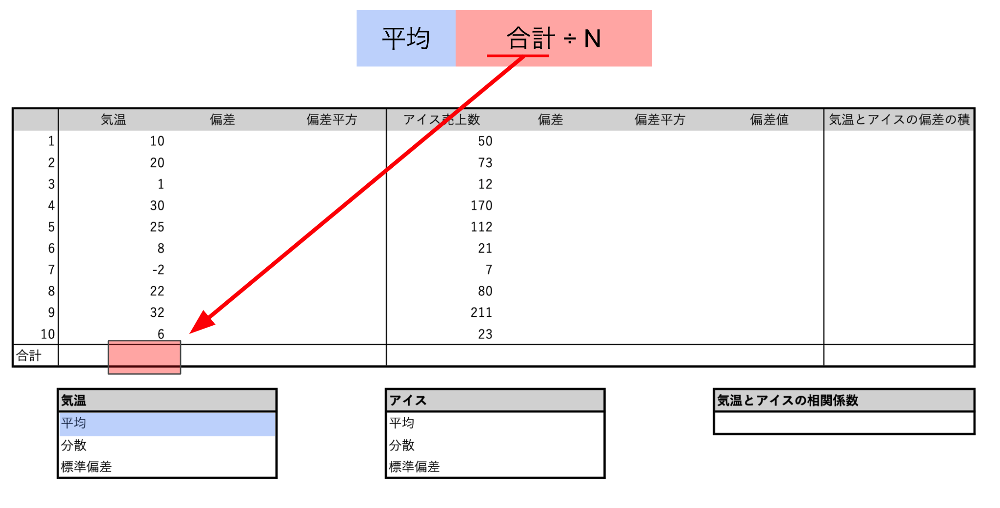

###

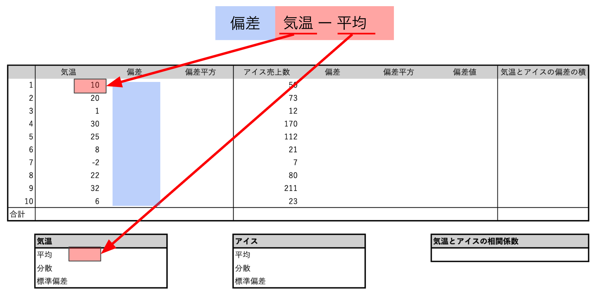

###

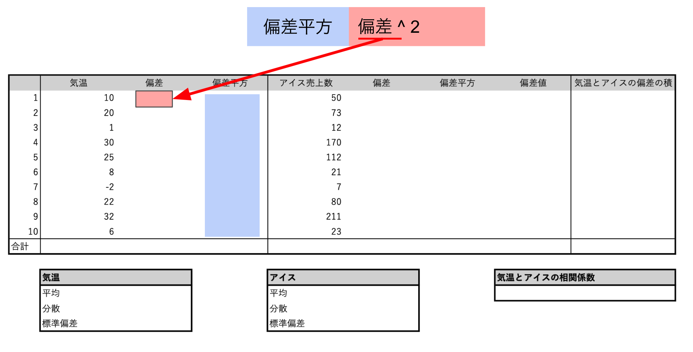

###

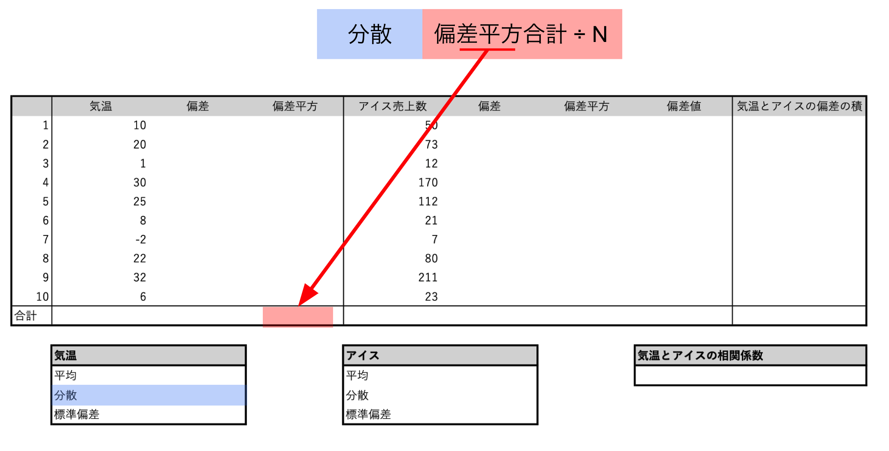

###

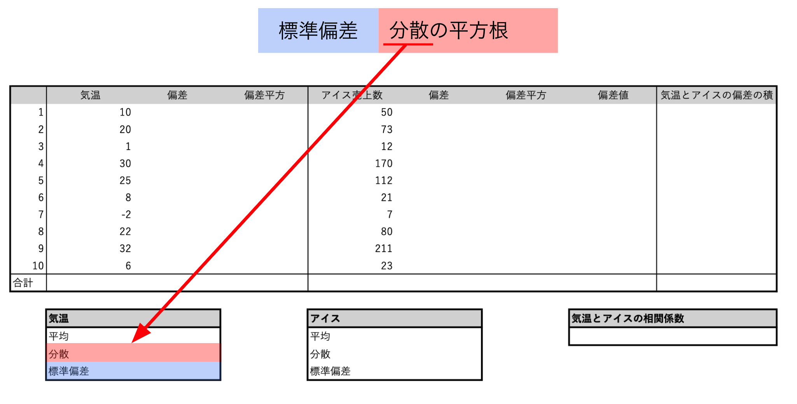

###

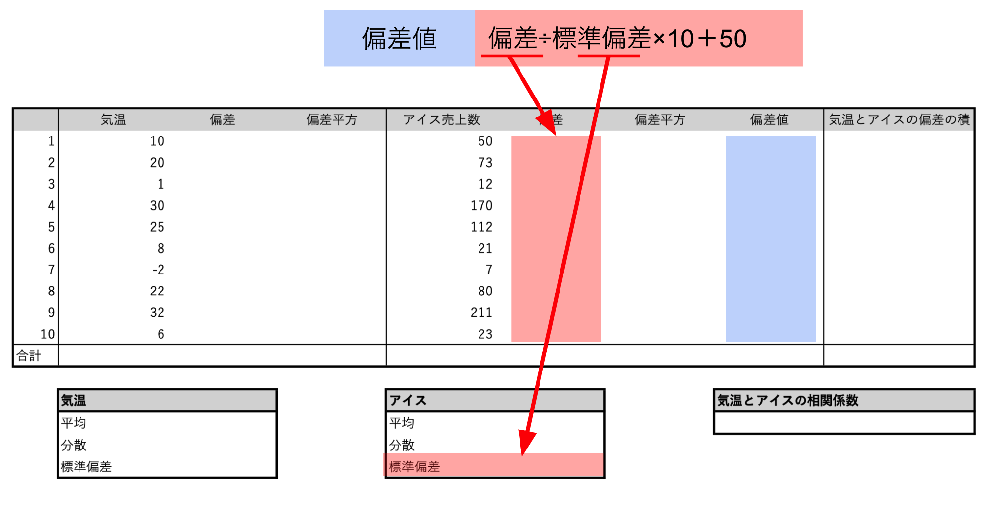

###

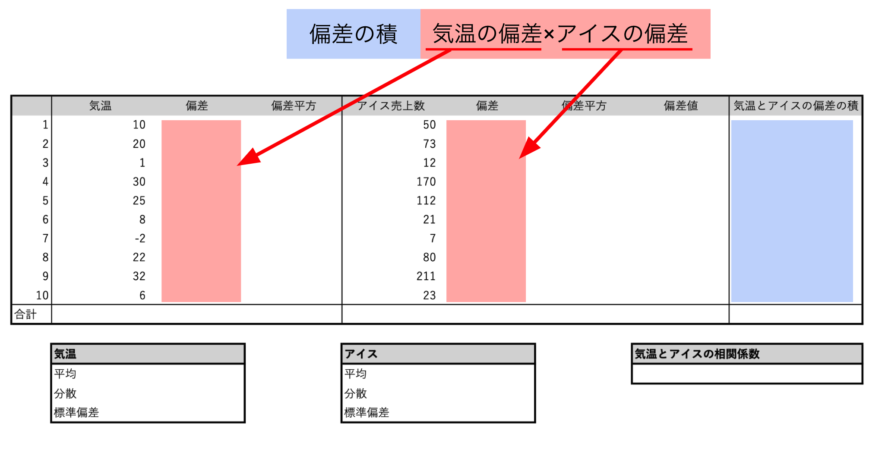

###

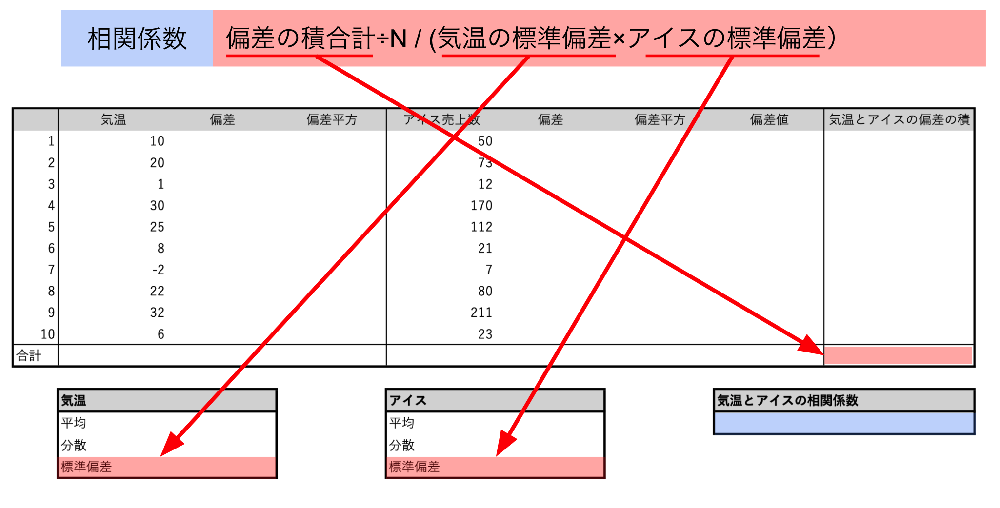

###

期末試験復習

<large>

❷箱ヒゲ図

</large>

###

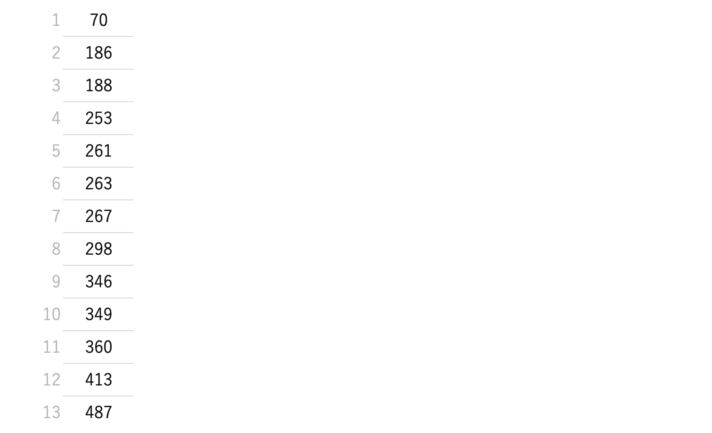

###

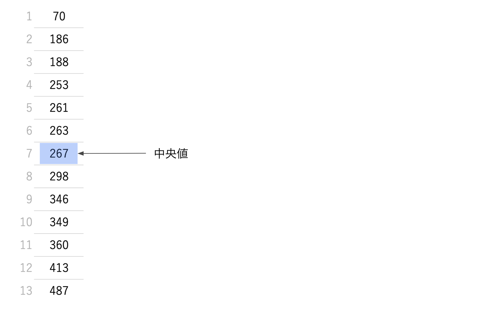

###

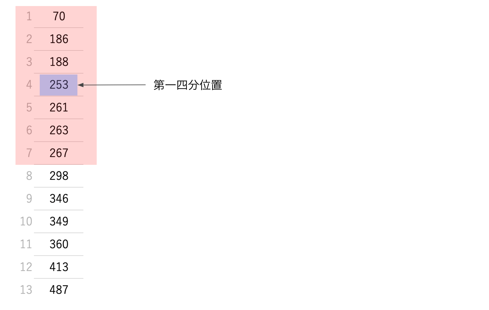

###

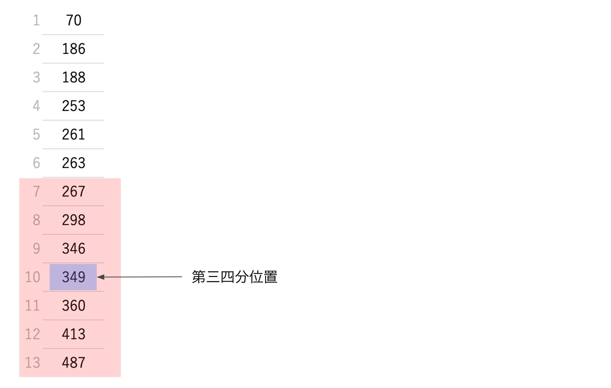

###

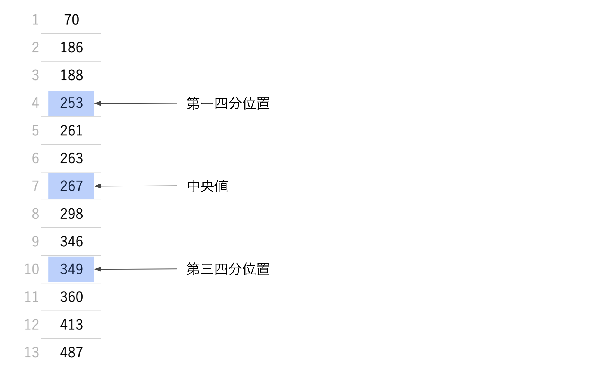

###

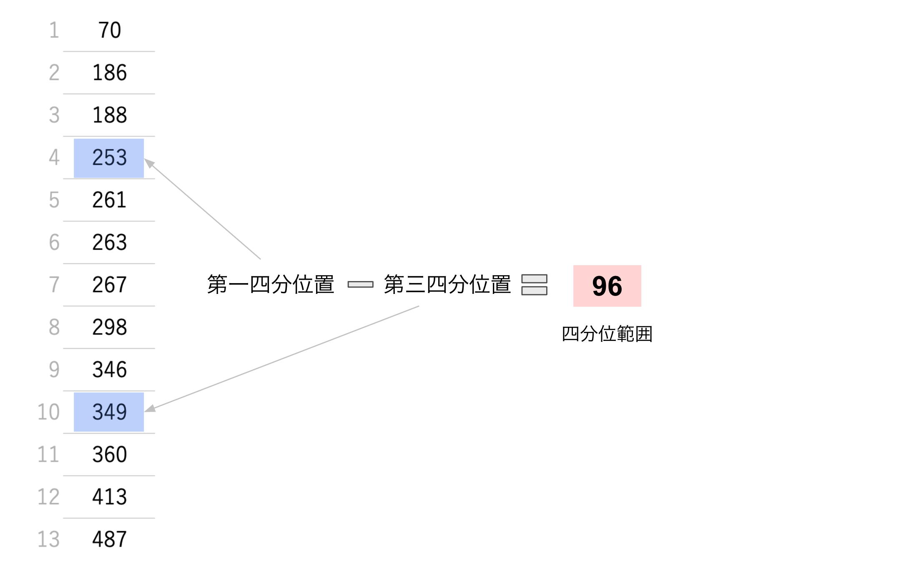

###

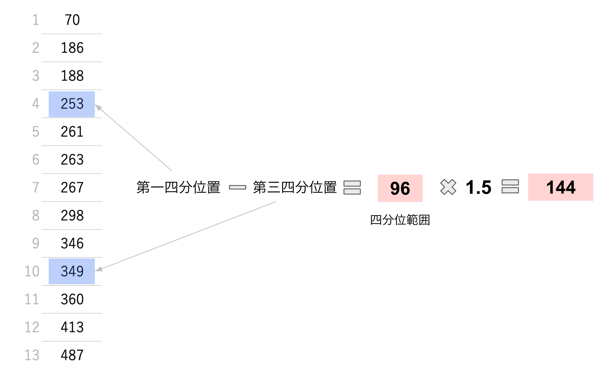

###

###

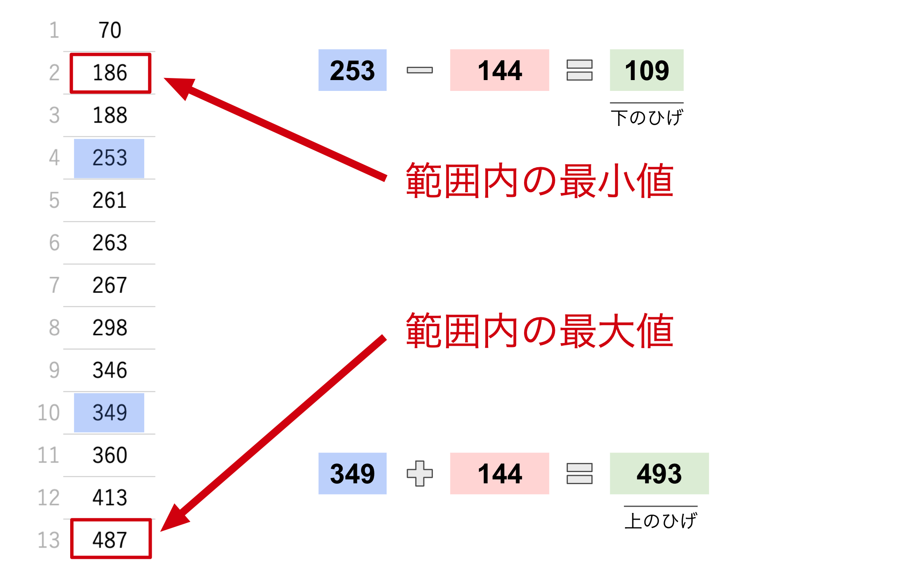

###

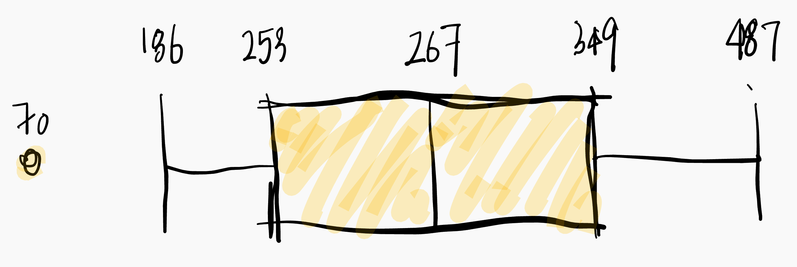
###

期末試験復習

<large>

❸寄与度・寄与率

</large>

###

日本の人口

 -|2000|2022
 :--|--|--
総人口|126,925,843 | 124,947,000
総人口【男】| 62,110,764 | 60,758,000 
総人口【女】| 64,815,079 | 64,189,000

##

<gray><red>変化幅</red> = 新しい値 - 古い値</gray>

 -|2000|2022|変化幅
 :--|--|--|--
総人口|126,925,843 | 124,947,000|<red>-1,978,843</red>
総人口【男】| 62,110,764 | 60,758,000 |<red>-1,352,764</red>
総人口【女】| 64,815,079 | 64,189,000 |<red>-626,079</red>

##

<gray><red>変化率</red> =（新しい値 - 古い値） / 古い値 × 100</gray>

<medium>

 -|2000|2022|変化幅|変化率
 :--|--|--|--|--
総人口|126,925,843 | 124,947,000|-1,978,843|<red>-1.56%</red>
総人口【男】| 62,110,764 | 60,758,000 |-1,352,764|<red>-2.18%</red>
総人口【女】| 64,815,079 | 64,189,000 |-626,079|<red>-0.97%</red>

##

<gray><red>構成比</red> =（要素の値 / 全体の値）</gray>

<medium>

 -|2000|2022|変化幅|変化率|構成比
 :--|--|--|--|--|--
総人口|126,925,843 | 124,947,000|-1,978,843|-1.56%|<red>1.00
総人口【男】| 62,110,764 | 60,758,000 |-1,352,764|-2.18%|<red>0.49
総人口【女】| 64,815,079 | 64,189,000 |-626,079|-0.97%|<red>0.51

</medium>

##

<gray><red>寄与度</red> = 変化率 x 構成比</gray>

<small>

 -|2000|2022|変化幅|変化率|構成比|寄与度
 :--|--|--|--|--|--|--
総人口|126,925,843 | 124,947,000|-1,978,843|-1.56%|1.00|<red>-1.56%</red>
総人口【男】| 62,110,764 | 60,758,000 |-1,352,764|-2.18%|0.49|<red>-1.07%</red>
総人口【女】| 64,815,079 | 64,189,000 |-626,079|-0.97%|0.51|<red>-0.49%</red>

</small>

##

<gray><red>寄与率</red> = 寄与度 / 全体の寄与度 x 100</gray>

<small>

 -|2000|2022|変化幅|変化率|構成比|寄与度|寄与率
 :--|--|--|--|--|--|--|--
総人口|126,925,843 | 124,947,000|-1,978,843|-1.56%|1|-1.56%|<red>100.00%</red>
総人口【男】| 62,110,764 | 60,758,000 |-1,352,764|-2.18%|0.49|-1.07%|<red>68.36%</red>
総人口【女】| 64,815,079 | 64,189,000 |-626,079|-0.97%|0.51|-0.49%|<red>31.64%</red>

</small>

##

<large>

練習期末テスト：大谷編

## Google Sheet で答え合わせ

クラスサイトからアクセスし、自分のドライブにコピー

action|formula
:--|:--
平均値|`=AVERAGE(A1:A10)`
分散|`=VAR.P(A1:A10)`
標準偏差|`=STDEV.P(A1:A10)`
共分散|`=COVARIANCE.P(A1:A10,B1:B10)`
相関係数|`=CORREL(A1:A10,B1:B10)`

<small>

＊ `(A1:A10)`はデータの幅なので当てはまる範囲に入れ替えよう

</small>